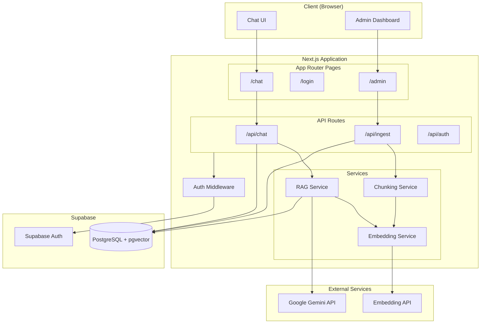
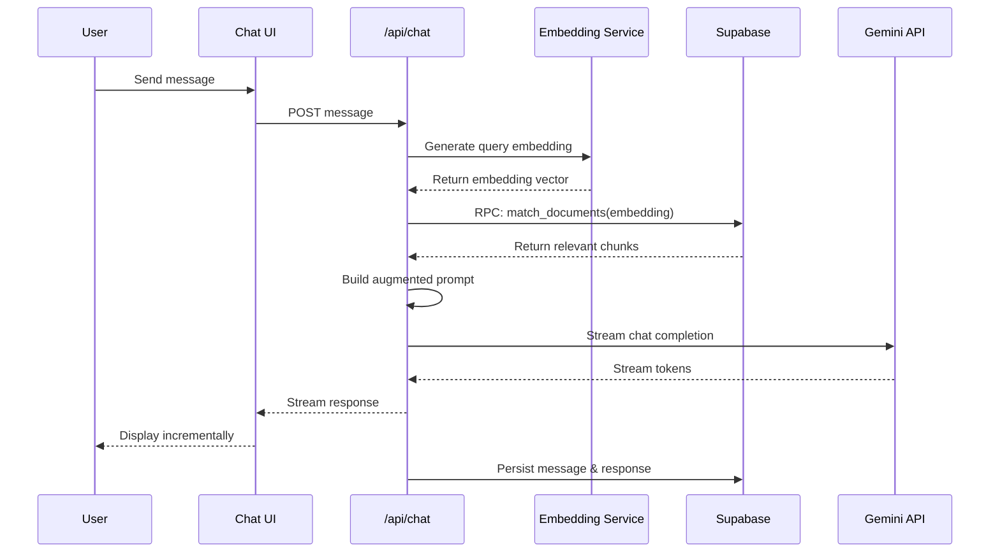

# Design Document: RAG Chat Application

## Overview

This document describes the technical design for a RAG (Retrieval-Augmented Generation) chat application built with Next.js 16(App Router), Google Gemini AI, and Supabase. The system provides an AI-powered chat interface that retrieves relevant context from a vector-indexed knowledge base to deliver accurate, contextual responses.

The application follows a three-tier architecture:
1. **Presentation Layer**: Next.js React components with Vercel AI SDK and shadcn/ui
2. **Application Layer**: Next.js API routes handling business logic
3. **Data Layer**: Supabase (PostgreSQL with pgvector extension)

### UI Framework: shadcn/ui

The application uses **shadcn/ui** for consistent, accessible, and customizable UI components. shadcn/ui provides:
- Pre-built, accessible components based on Radix UI primitives
- Tailwind CSS styling with full customization support
- Copy-paste component architecture (components live in your codebase)
- Dark mode support out of the box

## Architecture



### Request Flow: RAG Chat



## Components and Interfaces

### 1. Authentication Components

#### `lib/supabase/client.ts`
```typescript
// Browser-side Supabase client
export function createBrowserClient(): SupabaseClient
```

#### `lib/supabase/server.ts`
```typescript
// Server-side Supabase client with cookie handling
export function createServerClient(): SupabaseClient
```

#### `middleware.ts`
```typescript
// Next.js middleware for route protection
export function middleware(request: NextRequest): NextResponse
```

#### `lib/actions/auth.ts`
```typescript
// Server actions for authentication
export async function signUp(email: string, password: string): Promise<AuthResult>
export async function signIn(email: string, password: string): Promise<AuthResult>
export async function signOut(): Promise<void>

interface AuthResult {
  success: boolean;
  error?: string;
}
```

#### `scripts/seed-admin.ts`
```typescript
// Script to seed admin account from environment variables
// Reads ADMIN_EMAIL and ADMIN_PASSWORD from env
// Creates admin user in Supabase Auth and profiles table with role='admin'
export async function seedAdmin(): Promise<void>
```

### 2. Embedding Service

#### `lib/services/embedding.ts`
```typescript
interface EmbeddingService {
  // Generate embedding for a single text
  generateEmbedding(text: string): Promise<number[]>;
  
  // Generate embeddings for multiple texts (batch)
  generateEmbeddings(texts: string[]): Promise<number[][]>;
}
```

### 3. Chunking Service

#### `lib/services/chunking.ts`
```typescript
interface ChunkingService {
  // Split document into chunks of target size
  chunkDocument(content: string, options?: ChunkOptions): Chunk[];
}

interface ChunkOptions {
  minSize?: number;  // Default: 500
  maxSize?: number;  // Default: 1000
  overlap?: number;  // Default: 100
}

interface Chunk {
  content: string;
  index: number;
  metadata: {
    startChar: number;
    endChar: number;
  };
}
```

### 4. RAG Service

#### `lib/services/rag.ts`
```typescript
interface RAGService {
  // Retrieve relevant context for a query
  retrieveContext(query: string, limit?: number): Promise<RetrievedContext[]>;
  
  // Build augmented system prompt with context
  buildAugmentedPrompt(basePrompt: string, context: RetrievedContext[]): string;
}

interface RetrievedContext {
  content: string;
  similarity: number;
  metadata: Record<string, unknown>;
}
```

### 5. API Routes

#### `app/api/chat/route.ts`
```typescript
// POST: Handle chat messages with RAG
export async function POST(request: Request): Promise<Response>
// Returns: Streaming response using Vercel AI SDK
```

#### `app/api/ingest/route.ts`
```typescript
// POST: Ingest documents into knowledge base
export async function POST(request: Request): Promise<Response>
// Body: { content: string, metadata?: object }
// Returns: { success: boolean, chunksProcessed: number }
```

#### `app/api/chat/history/route.ts`
```typescript
// GET: Retrieve chat history for current user
export async function GET(request: Request): Promise<Response>
// Returns: { chats: Chat[] }
```

### 6. UI Components (shadcn/ui)

The UI is built using shadcn/ui components for consistent styling and accessibility.

#### Required shadcn/ui Components

```bash
# Core components to install
npx shadcn@latest init
npx shadcn@latest add button input card avatar scroll-area textarea
npx shadcn@latest add form label toast sonner
npx shadcn@latest add dropdown-menu dialog alert
```

#### `components/chat/ChatInterface.tsx`
```typescript
interface ChatInterfaceProps {
  initialMessages?: Message[];
  chatId?: string;
}
// Main chat component using useChat hook
// Uses: Card, ScrollArea, Button, Textarea from shadcn/ui
```

#### `components/chat/MessageList.tsx`
```typescript
interface MessageListProps {
  messages: Message[];
  isLoading: boolean;
}
// Renders conversation with user/AI distinction
// Uses: Avatar, Card from shadcn/ui
```

#### `components/chat/ChatInput.tsx`
```typescript
interface ChatInputProps {
  onSubmit: (message: string) => void;
  isLoading: boolean;
}
// Message input with send button
// Uses: Textarea, Button from shadcn/ui
```

#### `components/auth/LoginForm.tsx`
```typescript
interface LoginFormProps {
  onSuccess: () => void;
}
// Login form with email/password
// Uses: Card, Form, Input, Button, Label from shadcn/ui
```

#### `components/auth/SignupForm.tsx`
```typescript
interface SignupFormProps {
  onSuccess: () => void;
}
// Signup form with email/password and confirmation
// Creates user with 'user' role only
// Uses: Card, Form, Input, Button, Label from shadcn/ui
```

#### `components/admin/DocumentUpload.tsx`
```typescript
interface DocumentUploadProps {
  onUploadComplete: (result: UploadResult) => void;
}
// Admin component for document ingestion
// Uses: Card, Button, Input, Alert, Toast from shadcn/ui
```

#### `components/layout/Sidebar.tsx`
```typescript
// Chat history sidebar with new chat button
// Uses: Button, ScrollArea from shadcn/ui
```

#### Component Structure
```
components/
├── ui/                    # shadcn/ui components (auto-generated)
│   ├── button.tsx
│   ├── card.tsx
│   ├── input.tsx
│   ├── textarea.tsx
│   ├── avatar.tsx
│   ├── scroll-area.tsx
│   ├── form.tsx
│   ├── label.tsx
│   ├── toast.tsx
│   ├── dropdown-menu.tsx
│   ├── dialog.tsx
│   └── alert.tsx
├── chat/
│   ├── ChatInterface.tsx
│   ├── ChatInput.tsx
│   └── MessageList.tsx
├── auth/
│   ├── LoginForm.tsx
│   └── SignupForm.tsx
├── admin/
│   └── DocumentUpload.tsx
└── layout/
    ├── Sidebar.tsx
    └── Header.tsx
```

## Data Models

### Database Schema

```sql
-- Enable pgvector extension
CREATE EXTENSION IF NOT EXISTS vector;

-- Users table (managed by Supabase Auth, extended with role)
CREATE TABLE public.profiles (
  id UUID REFERENCES auth.users(id) PRIMARY KEY,
  email TEXT NOT NULL,
  role TEXT NOT NULL DEFAULT 'user' CHECK (role IN ('user', 'admin')),
  created_at TIMESTAMPTZ DEFAULT NOW()
);

-- Documents table for knowledge base
CREATE TABLE public.documents (
  id UUID PRIMARY KEY DEFAULT gen_random_uuid(),
  content TEXT NOT NULL,
  embedding vector(768),  -- embedding-001 produces 768 dimensions
  metadata JSONB DEFAULT '{}',
  created_at TIMESTAMPTZ DEFAULT NOW(),
  created_by UUID REFERENCES public.profiles(id)
);

-- Index for vector similarity search
CREATE INDEX ON public.documents 
USING ivfflat (embedding vector_cosine_ops)
WITH (lists = 100);

-- Chats table
CREATE TABLE public.chats (
  id UUID PRIMARY KEY DEFAULT gen_random_uuid(),
  user_id UUID REFERENCES public.profiles(id) NOT NULL,
  title TEXT,
  created_at TIMESTAMPTZ DEFAULT NOW(),
  updated_at TIMESTAMPTZ DEFAULT NOW()
);

-- Messages table
CREATE TABLE public.messages (
  id UUID PRIMARY KEY DEFAULT gen_random_uuid(),
  chat_id UUID REFERENCES public.chats(id) ON DELETE CASCADE NOT NULL,
  role TEXT NOT NULL CHECK (role IN ('user', 'assistant', 'system')),
  content TEXT NOT NULL,
  created_at TIMESTAMPTZ DEFAULT NOW()
);

-- Vector search RPC function
CREATE OR REPLACE FUNCTION match_documents(
  query_embedding vector(768),
  match_threshold FLOAT DEFAULT 0.7,
  match_count INT DEFAULT 5
)
RETURNS TABLE (
  id UUID,
  content TEXT,
  metadata JSONB,
  similarity FLOAT
)
LANGUAGE plpgsql
AS $$
BEGIN
  RETURN QUERY
  SELECT
    d.id,
    d.content,
    d.metadata,
    1 - (d.embedding <=> query_embedding) AS similarity
  FROM public.documents d
  WHERE 1 - (d.embedding <=> query_embedding) > match_threshold
  ORDER BY d.embedding <=> query_embedding
  LIMIT match_count;
END;
$$;
```

### TypeScript Types

```typescript
// lib/types/database.ts

interface Profile {
  id: string;
  email: string;
  role: 'user' | 'admin';
  created_at: string;
}

interface Document {
  id: string;
  content: string;
  embedding?: number[];
  metadata: Record<string, unknown>;
  created_at: string;
  created_by: string;
}

interface Chat {
  id: string;
  user_id: string;
  title: string | null;
  created_at: string;
  updated_at: string;
}

interface Message {
  id: string;
  chat_id: string;
  role: 'user' | 'assistant' | 'system';
  content: string;
  created_at: string;
}

interface RetrievedDocument {
  id: string;
  content: string;
  metadata: Record<string, unknown>;
  similarity: number;
}
```

### Environment Variables

```typescript
// Required environment variables
interface EnvConfig {
  // Supabase
  NEXT_PUBLIC_SUPABASE_URL: string;
  NEXT_PUBLIC_SUPABASE_ANON_KEY: string;
  SUPABASE_SERVICE_ROLE_KEY: string;
  
  // Google AI
  GOOGLE_GENERATIVE_AI_API_KEY: string;
  
  // Admin Seeding (used by seed script)
  ADMIN_EMAIL: string;
  ADMIN_PASSWORD: string;
}
```


## Correctness Properties

*A property is a characteristic or behavior that should hold true across all valid executions of a system-essentially, a formal statement about what the system should do. Properties serve as the bridge between human-readable specifications and machine-verifiable correctness guarantees.*

Based on the acceptance criteria analysis, the following correctness properties must be validated through property-based testing:

### Property 1: Signup Creates User Role Only

*For any* valid signup request with email and password, the created user profile SHALL have the role set to 'user' and never 'admin'.

**Validates: Requirements 1.2, 3.5**

### Property 2: Duplicate Email Rejection

*For any* signup request with an email that already exists in the system, the signup SHALL fail and return an appropriate error.

**Validates: Requirements 1.3**

### Property 3: Protected Route Redirection

*For any* protected route and *any* unauthenticated request, the middleware SHALL return a redirect response to the login page.

**Validates: Requirements 2.3**

### Property 4: Session Termination on Logout

*For any* valid user session, invoking the logout function SHALL result in the session being invalidated and no longer retrievable.

**Validates: Requirements 2.4**

### Property 5: Admin Route Access Control

*For any* admin-protected route and *any* user with admin role, the authorization check SHALL grant access.

**Validates: Requirements 3.2**

### Property 6: Non-Admin Route Denial

*For any* admin-protected route and *any* user without admin role, the authorization check SHALL deny access and return an unauthorized response.

**Validates: Requirements 3.3**

### Property 7: Document Chunking Size Bounds

*For any* text document, the chunking service SHALL produce chunks where each chunk (except possibly the last) has length between 500 and 1000 characters.

**Validates: Requirements 4.1**

### Property 8: Embedding Dimension Consistency

*For any* text input, the embedding service SHALL return a vector of exactly 768 dimensions (matching embedding-001 model output).

**Validates: Requirements 4.2, 5.1**

### Property 9: Document Storage Round-Trip

*For any* document chunk and its embedding, storing to the database and then retrieving by ID SHALL return the identical content and embedding values.

**Validates: Requirements 4.3**

### Property 10: Similarity Search Ordering

*For any* query embedding and document set, the similarity search results SHALL be ordered by similarity score in descending order.

**Validates: Requirements 5.2, 5.3**

### Property 11: Context Injection Completeness

*For any* set of retrieved context chunks, the augmented prompt SHALL contain the content of every chunk in the context set.

**Validates: Requirements 6.2**

### Property 12: Message Persistence Round-Trip

*For any* message (user or assistant), storing to the messages table and then retrieving by ID SHALL return the identical role and content.

**Validates: Requirements 7.1, 7.2**

### Property 13: Chat History Retrieval Completeness

*For any* user with existing chats, retrieving chat history SHALL return all chats belonging to that user and no chats belonging to other users.

**Validates: Requirements 7.3**

### Property 14: Environment Variable Validation

*For any* missing required environment variable, the configuration validation SHALL throw an error with a message identifying the missing variable.

**Validates: Requirements 10.2**

## Error Handling

### Authentication Errors

| Error Scenario | Handling Strategy |
|----------------|-------------------|
| Invalid credentials | Return 401 with generic "Invalid credentials" message |
| Expired session | Redirect to login, clear stale session data |
| Missing session | Redirect to login page |

### API Errors

| Error Scenario | Handling Strategy |
|----------------|-------------------|
| Gemini API failure | Return 503, log error, display retry option to user |
| Embedding API failure | Return 503, log error, display retry option to user |
| Rate limiting | Return 429 with retry-after header |
| Invalid request body | Return 400 with validation error details |

### Database Errors

| Error Scenario | Handling Strategy |
|----------------|-------------------|
| Connection failure | Return 503, implement retry with exponential backoff |
| Query timeout | Return 504, log slow query for optimization |
| Constraint violation | Return 400 with specific constraint error |

### Ingestion Errors

| Error Scenario | Handling Strategy |
|----------------|-------------------|
| Document too large | Return 413, suggest splitting document |
| Embedding generation failure | Retry up to 3 times, then return 500 with partial success info |
| Storage failure | Rollback transaction, return 500 with error details |

## Testing Strategy

### Property-Based Testing Framework

The application will use **fast-check** as the property-based testing library for TypeScript/JavaScript. Each property test will run a minimum of 100 iterations.

```typescript
import fc from 'fast-check';
```

### Test Organization

```
__tests__/
├── unit/
│   ├── services/
│   │   ├── chunking.test.ts
│   │   ├── embedding.test.ts
│   │   └── rag.test.ts
│   ├── middleware/
│   │   └── auth.test.ts
│   └── utils/
│       └── config.test.ts
├── properties/
│   ├── chunking.property.test.ts
│   ├── embedding.property.test.ts
│   ├── auth.property.test.ts
│   ├── persistence.property.test.ts
│   └── search.property.test.ts
└── integration/
    ├── chat-flow.test.ts
    └── ingestion-flow.test.ts
```

### Unit Testing Approach

Unit tests will cover:
- Individual service method behavior with specific inputs
- Edge cases (empty inputs, boundary values)
- Error condition handling
- Component rendering (using React Testing Library)

### Property-Based Testing Approach

Each correctness property will be implemented as a property-based test with:
- Custom generators for domain-specific data (documents, embeddings, users)
- Minimum 100 iterations per property
- Explicit reference to the design document property being tested

Example property test annotation:
```typescript
/**
 * Feature: rag-chat-app, Property 5: Document Chunking Size Bounds
 * Validates: Requirements 3.1
 */
test.prop([fc.string({ minLength: 100, maxLength: 10000 })])(
  'chunks are within size bounds',
  (document) => {
    const chunks = chunkDocument(document);
    return chunks.slice(0, -1).every(
      chunk => chunk.content.length >= 500 && chunk.content.length <= 1000
    );
  }
);
```

### Integration Testing

Integration tests will verify:
- Complete RAG flow from query to response
- Document ingestion pipeline end-to-end
- Authentication flow with Supabase

### Test Data Generators

Custom fast-check arbitraries for domain types:

```typescript
// Document content generator
const documentArb = fc.string({ minLength: 100, maxLength: 50000 });

// Embedding vector generator (768 dimensions)
const embeddingArb = fc.array(fc.float({ min: -1, max: 1 }), { 
  minLength: 768, 
  maxLength: 768 
});

// User profile generator
const profileArb = fc.record({
  id: fc.uuid(),
  email: fc.emailAddress(),
  role: fc.constantFrom('user', 'admin')
});

// Message generator
const messageArb = fc.record({
  role: fc.constantFrom('user', 'assistant'),
  content: fc.string({ minLength: 1, maxLength: 10000 })
});
```
